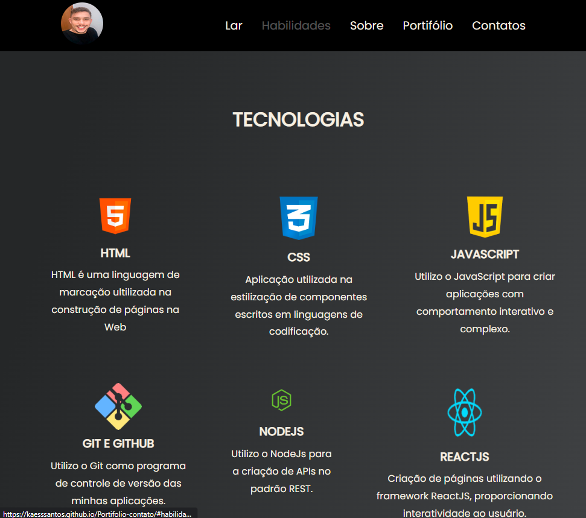
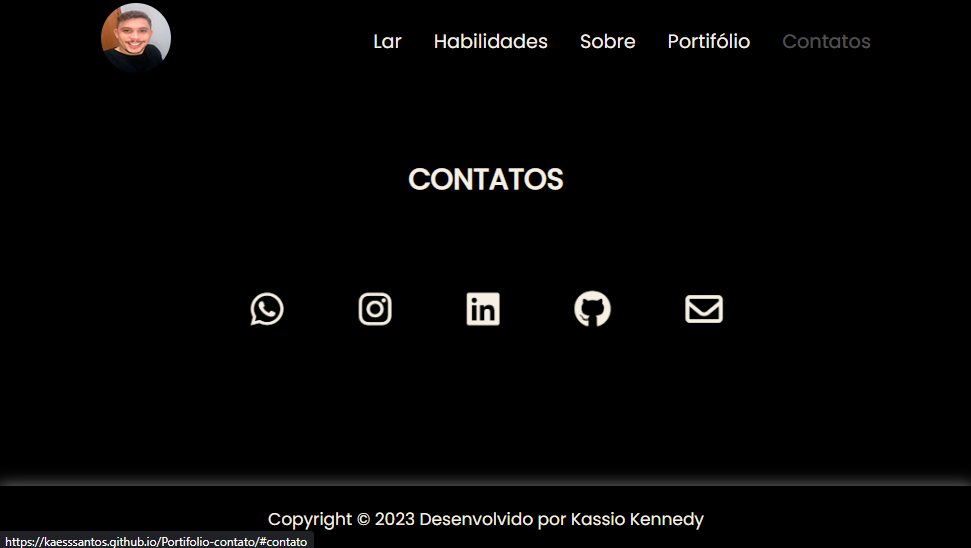
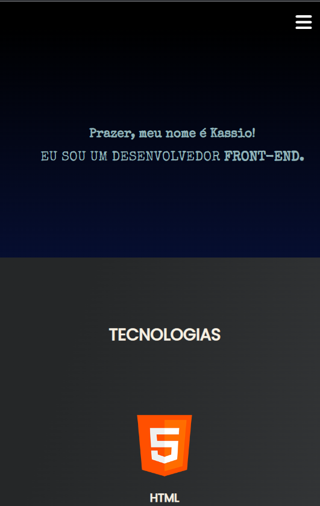
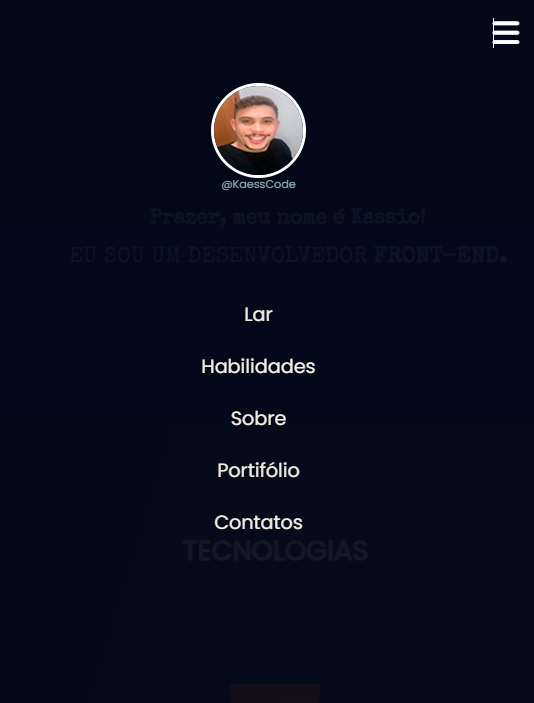

# Portifólio
 
 <h2 align="center"> Aqui apresento meus projetos e minhas habilidades como dev front-end</h2>
 #<a href="https://kaesssantos.github.io/Portifolio-contato/">Link Projeto</a>

 

    
 

 

    
 

 

    
 

 #Mobil
 

    
 

 

    
 

 ## 🚀 Tecnologias

 Esse projeto foi desenvolvido com as seguindes tecnologias:

 - HTML e CSS 
 - JavaScript
 - GitHub
 - Visual Studio Code

 ## 💻 Projeto

Portifólio feito com o intuito de mostrar um pouco das minhas habilidades como dev front-end.

 ## :memo: Licença 

 Esse projeto está sobre a licença MIT.

